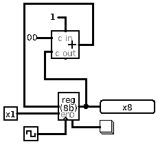

# About this module

-   Prerequisites: [0298](../0298/mdModule.html)

-   Objectives: This module discusses how simple clocked circuits work.

# Registers

A "register" is a multi-bit, usually resettable, usually gated, and
usually edge-sensitive D-flipflop. A register usually has the following
ports (interfaces):

-   *D*ata: The D port serves as a multi-bit input port so that new
    content can be specified. Upon presentation of new data, however, a
    register does not update immediately.

-   *cl*oc*k*: the clk port is edge sensitive, we assume it is rising
    edge sensitive. A register only updates when the edge occurs. This
    is important because it limits the actual update to a very short
    window when the D port has a valid date.

-   *en*able: the en port is level sensitive and "gates" a register In a
    processor, many registers often share the same system-wide clock
    signal and data bus. The en port allows a single bit be used to
    designate which register be overwritten.

-   *reset*, also called clear: this port is active low. When asserted
    (low), a register resets its value to 0.

-   *Q*: this is the multi-bit output port, it always presents the
    current value of the register.

Though somewhat complex compared to an SR latch and simpler D-flipflops,
a register is still considered fairly simple and therefore fast.
Registers can keep up with computational circuits like adders and
subtractors.

# Synchronizing operations

Every component of a processor has a latency, measured as the time
between the input signals presented and the output signals reflecting
the operation of the component. For instance, a 3-bit carry-lookahead
adder has a latency delay that is equivalent to 5 times the latency
delay of a simple gate (AND, OR, XOR).

As a result, it is important to have a basic beat to provide a system
wide time base for all components in a processor. This time base is
often called the system clock or simply the clock.

The clock signal is often a fixed-frequency square wave. The edges of a
a clock signal is like the drum or bass beat of the music, providing a timing
mechanism for all the components.

Not all components of a processor are "clocked". A clocked component is
one that updates or performs an operation when the clock input
transitions (from low to high, or from high to low). For example, an
adder or a subtractor is not clocked. Such circuits stars to respond to
input changes as soon as the changes occur.

On the other hand, components like registers are clocked. This means
that the input signal of a register can change arbitrarily. Unless the
clock input has a transition, all changes to the other input ports are
ignored and the internal state of a register is not altered.

## Example

This is a circuit that increments the value of the register when the
clock ticks.

Note how the adder is "always" outputting a value that is one more than
the output of the register. "Always" is quoted because there is a slight
latency between the input of the adder changing and the output of the
adder reflecting that change. In return, the output of the adder is
connected to the input of the register.

The key to this design is the clock signal. While the simulator allows
the clock to be clicked manually. In a real computer, however, the
clock signal keeps ticking. This can also be emulated in
Logisim.

The update of the register is gated by the enable (EN) port. Once
enabled, the register only updates when there is a rising edge at the
clock port. This permits the register to increment, but only once. After
the rising edge, despite the adder presenting a number that is one more
than the output of the register itself, the register does not update due
to its edge sensitivity.

